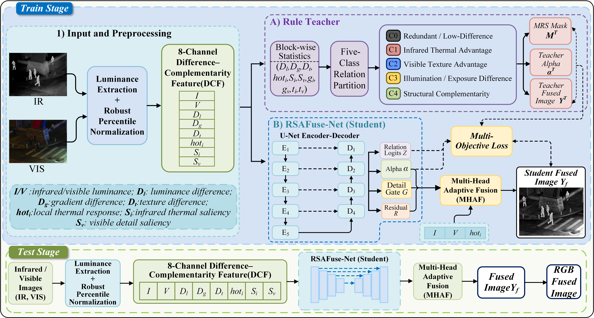
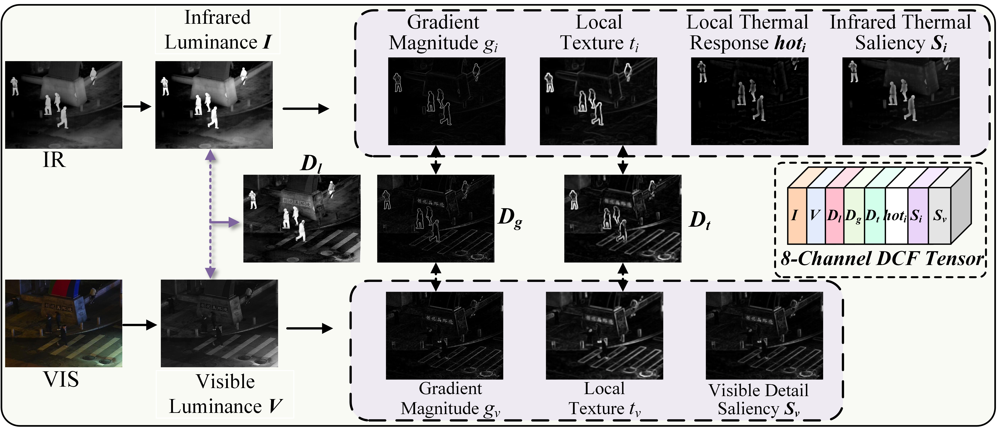
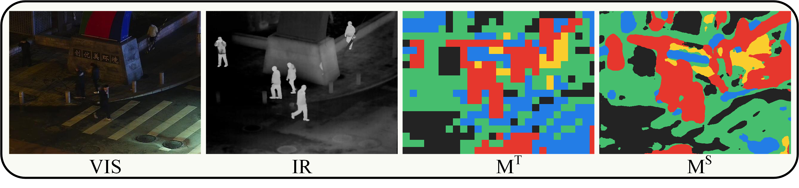
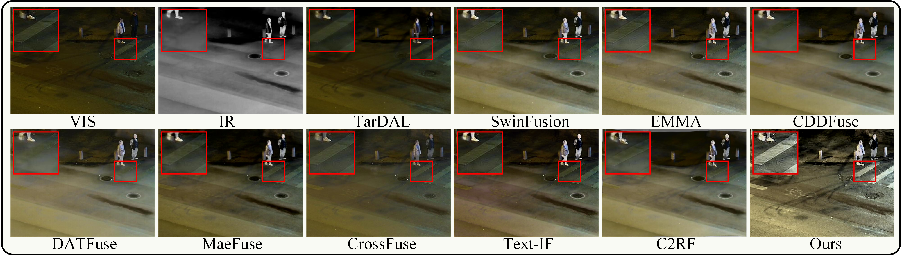
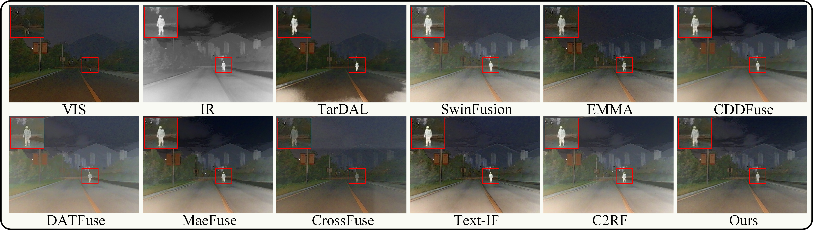
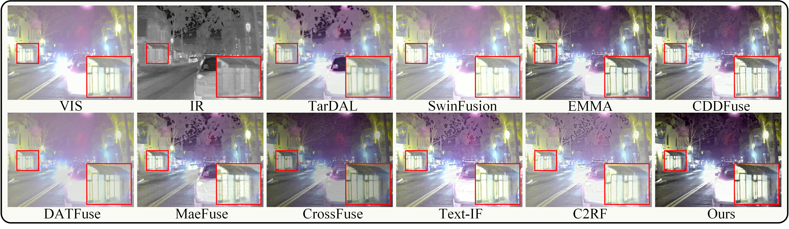
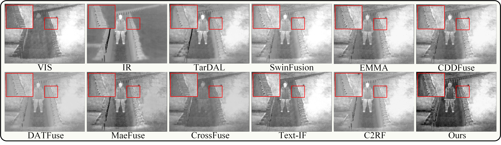
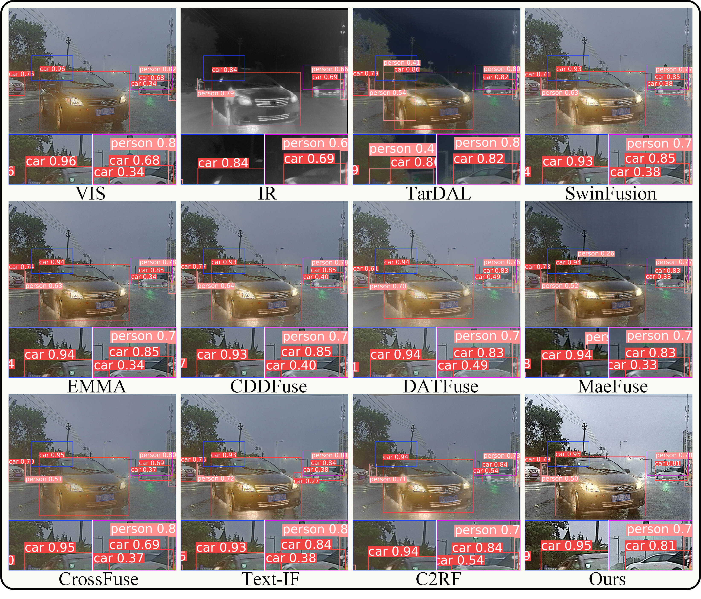
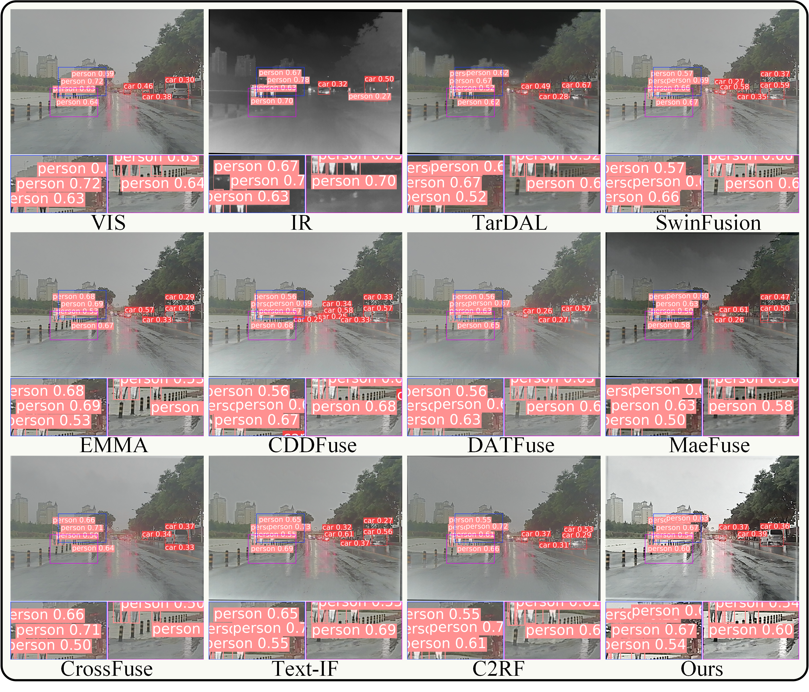

# RSAFuse

**Relation-semantic guided adaptive infrared and visible image fusion.**

This private research snapshot contains the core implementation, four local
evaluation subsets, and selected author-supplied figures. It does not include
trained weights, ablation experiments, training data, or local machine settings.

The implementation retains its original `regfuse_net` module and `RegFuseUNet`
class names for compatibility. RSAFuse was previously named MRSPFuse/RegFuse.

## Overview



1. Construct an eight-channel input from the registered infrared/visible pair:
   `[I, V, D_l, D_g, D_t, hot_i, S_i, S_v]`.
2. During training, a fixed rule teacher generates local relation labels and
   infrared mixing weights. A rule-guided fusion function supplies a
   single-channel teacher image; this is a training reference, not ground truth.
3. A U-Net predicts four parallel outputs: five-class relation logits, a mixing
   weight, a detail gate, and a residual correction.
4. `compose_fusion` combines normalized source luminance with the predicted
   controls. Visible chroma is used to reconstruct an RGB display image.

The relation head is an auxiliary training branch. Its logits are not used as
discrete routing decisions in the final fusion operation. The rule teacher is
not executed by the inference script.



## Repository Contents

```text
regfuse_net/
  features.py               Feature construction and fixed rule teacher
  model.py                  Shared U-Net and four parallel prediction heads
  dataset.py                Paired data loading, augmentation, teacher targets
  losses.py                 Fusion composition and unchanged training objective
prepare_pseudo_dataset.py    Generate relation/weight targets and data splits
train_regfuse_net.py         Network training
infer_regfuse_net.py         Grayscale/RGB fusion and control-map export
eval_fusion_metrics.py      Existing fusion metric implementation
test/                      Four paired local evaluation subsets
docs/                      Implementation notes and selected figures
```

## Installation

Use a clean Python 3.9-3.11 environment. Dependency ranges below are compatibility
constraints, not a frozen record of the original training environment. Install a
PyTorch build appropriate to your CUDA driver, then install the requirements:

```bash
python -m venv .venv
# Linux/macOS: source .venv/bin/activate
# Windows PowerShell: .venv\Scripts\Activate.ps1
python -m pip install -r requirements.txt
```

The upper PyTorch bound preserves the checkpoint-loading behavior of the
unchanged scripts. Only load checkpoints from a trusted source.

## Training

Training images are not included. Place registered MSRS training pairs under
`MSRS_train/ir` and `MSRS_train/vi`, with matching filename stems. Obtain the
dataset from its original provider and follow its terms of use.

```bash
python prepare_pseudo_dataset.py --root . --ir-dir MSRS_train/ir --vi-dir MSRS_train/vi --out pseudo_labels/MSRS_train --splits splits
python train_regfuse_net.py --root . --save-dir checkpoints/regfuse_v2 --epochs 160 --batch-size 8 --crop-size 256 --base-channels 32 --workers 8 --amp
```

These commands use the current code defaults.
For CPU execution, omit `--amp`, use `--device cpu`, and reduce workers as needed.

The preparation script creates class masks, weight maps and a seeded 90/10
train/validation split. `dataset.py` constructs the teacher fused luminance
while loading each sample. Do not use the included evaluation images as
training data when reporting test results.

## Inference

Weights are intentionally excluded. Supply your compatible checkpoint locally
at `checkpoints/regfuse_v2/best.pth`, or pass another checkpoint path.

```bash
python infer_regfuse_net.py --root . --checkpoint checkpoints/regfuse_v2/best.pth --datasets LLVIP,M3FD,RoadScene,TNO --out runs/rsafuse_infer
```

For each dataset the script saves `fused_gray`, `fused_color`, `alpha`, and
`mask_color`. The diagnostic `mask_color` image is not an object segmentation
ground truth. Images are paired by matching filename stem under
`test/<dataset>/Inf` and `test/<dataset>/Vis`.

## Fusion Metrics

```bash
python eval_fusion_metrics.py --root . --fused-root runs/rsafuse_infer --datasets LLVIP,M3FD,RoadScene,TNO --fused-subdir fused_gray --out metrics/rsafuse
```

This existing script exports per-image and dataset-mean CSVs. It currently
computes EN, SD, SF, MI, SCD, VIF, Qabf, SSIM, AG and Nabf. It has not been
rewritten to match a different metric convention. Install all listed metric
dependencies: missing optional libraries activate fallback implementations that
can change values. See the implementation notes before comparing reported
numbers with another implementation.

## Selected Figures

The following figures were supplied by the author and are included unchanged.
They are illustrative examples, not a substitute for full-subset quantitative
evaluation. "Ours" denotes RSAFuse.

### Local Relation Labels



`M^T` is the fixed teacher's relation label map; `M^S` is the student's predicted
relation map. The colors describe modality relationships, not object classes.

### Fusion Comparisons

**LLVIP**



**M3FD**



**RoadScene**



**TNO**



### Supplementary Detection Examples

These author-supplied M3FD examples show saved predictions from a fixed
COCO-pretrained YOLOv8s detector, evaluating person/car, displayed on RGB fusion
images. The saved fusion predictions were obtained from grayscale evaluation
inputs; replacing the RGB display background does not constitute a new RGB
detection evaluation. Detection confidences are not image-level accuracy scores.
Selected zoomed regions are illustrative and do not establish overall superiority.





## Release Scope

No trained checkpoints, detector weights, ablation files, full comparison-output
trees, detection environments, IDE settings, credentials, server addresses, or
manuscript documents are included. No open-source license or publication status
is asserted by this private snapshot. Dataset images and third-party comparison
material retain their original rights; review redistribution conditions before
making this repository public.
